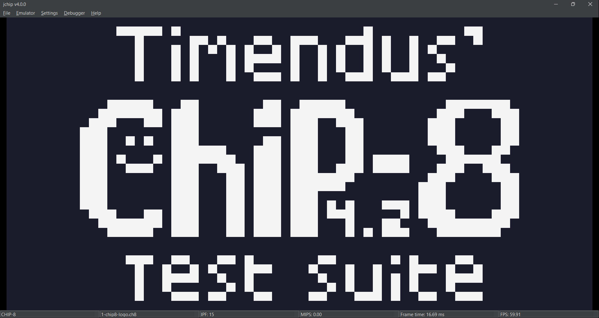
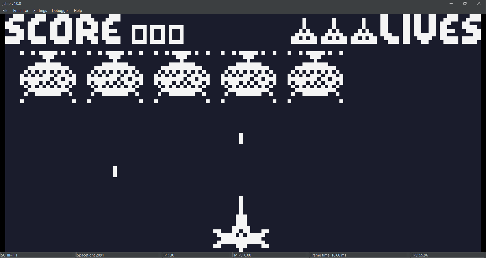
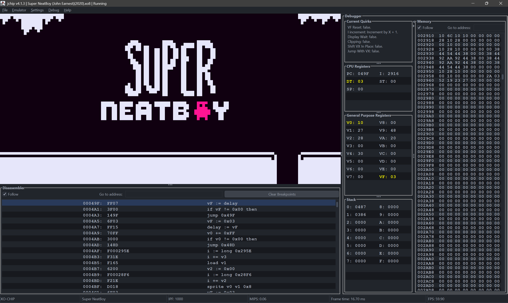
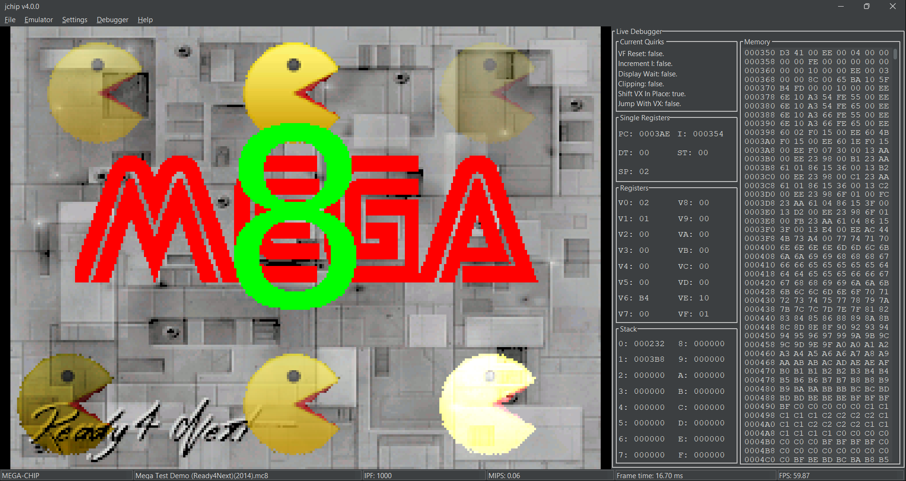
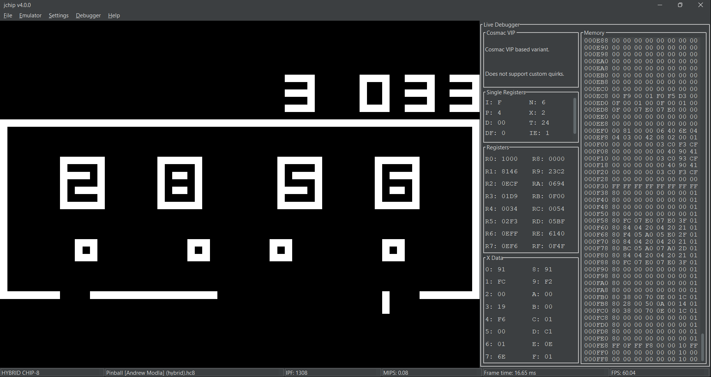
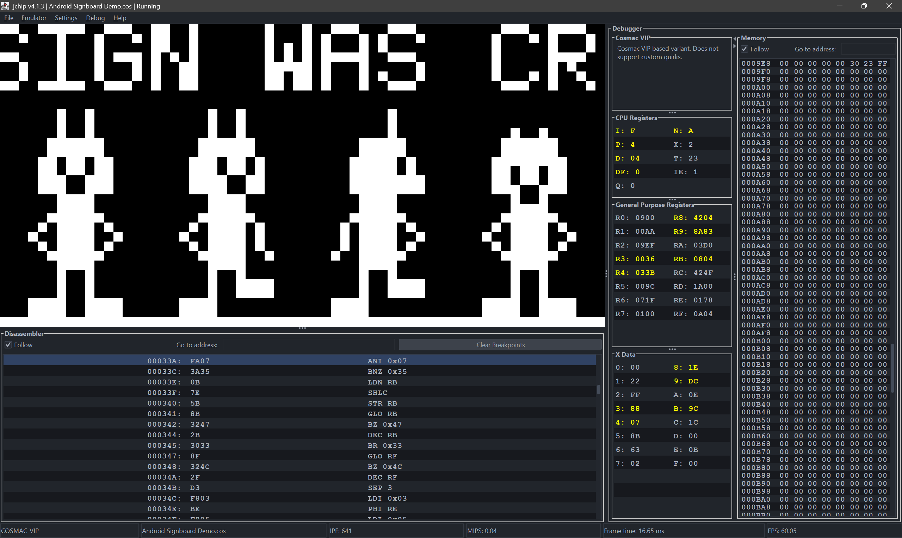

<p align="center">
  
  
</p>

<p align="center">
  
  
</p>

<p align="center">
  
  
</p>

# jchip

A multi-variant CHIP-8 interpreter and COSMAC-VIP emulator written in Java.


[](https://github.com/arkosammy12/jchip/tree/v4.1.3)

* [jchip](#jchip)
* [Introduction](#introduction)
* [Features](#features)
  * [Variants](#variants)
  * [Configurable quirks](#configurable-quirks)
  * [Debugger and Disassembler](#debugger-and-disassembler)
  * [Database](#database)
* [Usage](#usage)
  * [Menus](#menus)
  * [Command line](#command-line)
* [Building from Source](#building-from-source)
* [Libraries used](#libraries-used)
* [Resources and general links](#resources-and-general-links)
* [Credits](#credits)
* [License](#license)

## Introduction

After branching out to other areas of programming, I came across the world of emulation. I discovered that the first system recommended for beginners to emulate is called CHIP-8.
CHIP-8 was originally a programming language ran by interpreter developed for the [COSMAC-VIP](https://en.wikipedia.org/wiki/COSMAC_VIP) computer from the late 1970s, which allowed its users to program games for it with a small and easy to understand instruction set.

Unlike most people who use CHIP-8 as a stepping stone to building actual emulators for systems like the Game Boy or NES, I found myself captivated by this small but interesting platform.
I found out that CHIP-8 is just the first of a family of variants and extensions all building off of the same foundation. CHIP-8 as a platform has remained relatively alive via more modern implementations that add new features, which even allowed for game jams to be hosted for it, called [OctoJams](https://johnearnest.github.io/chip8Archive/?sort=platform).

Thus, **jchip** has evolved from a rudimentary bare-bones interpreter into my first gateway into emulation and proper application development. My appreciation for CHIP-8 and its community is demonstrated by implementing as many variants as accurately as possible, while providing extra convenience features for customization, debugging, and ease of use.
As a token of appreciation, jchip also includes a full-fledged COSMAC-VIP emulator variant for people who want to try out ROMs made for this computer.

## Features

CHIP-8, along with the other variants supported by this emulator, were implemented using a combination of [high level guides](https://tobiasvl.github.io/blog/write-a-chip-8-emulator/), 
as well as the most accurate [opcode table](https://chip8.gulrak.net/) I could find.
Any small details were clarified to me by the more experienced people on the `#chip-8` channel of the EmuDev discord server.

### Variants

As mentioned, CHIP-8 comprises a family of variants all based on the same fundamental specification. Most variants add new instructions and functionality on top of CHIP-8,
and others alter or completely replace the behavior of existing opcodes. The full list of supported variants is the following:

1. `CHIP-8`: An implementation of the original CHIP-8 interpreter for the COSMAC-VIP, as developed by Joseph Weisbecker. A complete documentation of CHIP-8's usage as well as its implementation on the VIP
can be found in the [RCA COSMAC VIP CDP18S711 Instruction Manual](https://storage.googleapis.com/wzukusers/user-34724694/documents/130d458901764787969269f48aeeee2a/VIP_Manual.pdf).
2. `STRICT-CHIP-8`: An HLE cycle accurate implementation of CHIP-8, modeling interrupt timings for audio, video, and timer updates. This variant also implements proper memory mapping of the CHIP-8 interpreter address space on the COSMAC-VIP.
Note that this variant cannot run hybrid CHIP-8 roms, which are those that utilize instruction group `0NNN` in order to call native subroutines belonging to the COSMAC-VIP itself. This variant also ignores any user configured quirks or IPF, as it strictly adheres to the original implementation and timings. The implementation of this core is heavily based on [Cadmium's](https://github.com/gulrak/cadmium) `chip8-strict` core. Many thanks to [@Gulrak](https://github.com/gulrak) for letting me borrow his implementation.
3. `CHIP-8X`: An official extension of CHIP-8 by RCA which adds support for low and high resolution color modes for a total of 4 background colors and 8 foreground colors. It also added instructions for communicating with I/O devices, support for a second keypad, and an octal addition instruction.
Note that the second keypad and I/O instructions are stubbed except for `FXF8`, where `vX` is used to set the pitch of the buzzer. 
4. `SUPER-CHIP-1.1`: Also known as `SUPER-CHIP-LEGACY` in today's times, this is the last in a subset of extensions made for the HP 48 calculators. Starting with CHIP-48, which was purely a reimplementation of the original interpreter, it failed to reproduce the original behavior of several instructions, giving rise to the first quirks.
SUPER-CHIP 1.0 was released for newer models of the calculator, and added a high and low resolution modes, the former expanding the display resolution to 128 by 64 pixels, the ability to draw 16 by 16 sprites, and a feature to persist the scratchpad registers onto a set of flags register which retain their values across emulator restarts.
Finally, SUPER-CHIP 1.1 was an extension developed by Erik Brynste and added new scrolling instructions and an instruction to point the index register `I` to one of the new big font sprites now built into the interpreter.
5. `SUPER-CHIP-MODERN`: This variant corresponds to [Octo's](https://github.com/JohnEarnest/Octo) generic implementation of the SUPER-CHIP extension. This variant differs from its legacy counterpart as it doesn't fully emulate certain quirks, visual artifacts, and collision detection handling during execution of a `DXYN` instruction.
As such, it is considered its own separate variant that is similar enough to SUPER-CHIP-LEGACY to fall into the SUPER-CHIP category. Note that developers using Octo that wish to target SUPER-CHIP will be using this "modern" variation instead.
6. `XO-CHIP`: Developed by John Earnest, it debuted alongside Octo as the most popular modernized version of CHIP-8 which most newcomers target when they start developing in Octo. Bringing a host of new features, including bit-plane based color support,
an expanded addressable range of 64KB allowing ROMs to store much more data such as sprites and audio, support for audio in the form of square wave audio samples as well as controllable pitch, and new instructions for more convenient memory manipulation.
Many newer games were made for this variant thanks to Octo and the Octojams hosted by John Earnest, and although Octojams are no longer being hosted, these games, along with many other programs, showcase the capability of this limited but fun fantasy console and, in my opinion, serves as a great way to
get into assembly-like languages.
7. `MEGA-CHIP`: Published by Revival Studios in 2007, this variant is relatively obscure within the community. Due to the fact that Revival Studios failed to deliver a complete implementation, many areas of the specification remain unclarified.
   As such, developers looking to implement this variant are free to fill in the gaps as they please, although most of the key details have been agreed upon by the community. At first, it behaves like a half-broken implementation of SUPER-CHIP. However, it adds new instructions to enable and disable a new "mega mode", which when enabled, actives MEGA-CHIP's features.
   It expands the display resolution to 256 by 192 pixels, supports loading ARGB color palettes for sprite drawing along with blending modes and an alpha value (the latter being undefined in its implementation), adds the ability to play raw 8 bit synthesized audio samples, and expands the addressable range to 16MB for even more sprite and audio data.
   The way screen updates and scrolling also changes, and this notably becomes a huge point of confusion for new developers looking to implement this variant. Nevertheless, due to its interesting features and the handful of demos that exist for it, I decided to include this variant in my emulator, in the hopes that it may gain more popularity in the future.
8. `HYPERWAVE-CHIP-64`: A newer and even lesser known variant developed by [@NinjaWeedle](https://github.com/NinjaWeedle/HyperWaveCHIP-64). Being an extension of XO-CHIP, this variant includes new multiplication and division instructions, three new instructions to take advantage of the expanded memory size for actual code instead of just assets, new drawing modes for more convenient display manipulation, and the ability for ROMs to load their own bit-plane based color palette,
instead of relying on the host emulator to supply the colors. This variant only has a few ROMs made mostly by the variant's developer and doesn't seem to have gained much traction. However, in the spirit of supporting newer extensions, I decided to implement it as a way to show support for possible new improvements to XO-CHIP, in the hopes that it will become more popular in the future.
9. `HYBRID CHIP-8`: This variant is backed by an emulator implementation of the original COSMAC-VIP computer from the RCA corporation. Powered by the CDP1802 microprocessor and the CDP1861C video display interface, this variant is capable of running hybrid CHIP-8 ROMs, which are those that require the use of native subroutine calls written in CDP1802 machine language.
    This variant does not support custom quirks, configurable color palettes, or IPF.
10. `HYBRID CHIP-8X`: This variant, while also being backed a COSMAC-VIP emulation core, implements the VP590 Color Board and the VP595 Simple Sound board expansions to add support for the original CHIP-8X interpreter. In the small off-chance that there are hybrid CHIP-8X ROMs out there, this variant can run them.
    This variant was mostly added as an extra bonus made purely for fun and for learning.
11. `COSMAC-VIP`: Providing support for hybrid CHIP-8 ROMs by emulating the COSMAC-VIP allows jchip to also provide a standalone COSMAC-VIP variant, which does not include the CHIP-8 interpreter and just loads the provided ROM at the start of memory. This variant is
    capable of running ROMs made for the original COSMAC-VIP computer, targeting at most 2KB of on-board RAM plus an additional 2KB of RAM expansion, for a total of 4KB. Since this is a raw COSMAC-VIP implementation, it also ignores any user configured quirks, color palette, or IPF.

### Configurable quirks

Due to intentional or unintentional failure to replicate the original implementation of certain instructions of the CHIP-8 interpreter, small but significant differences arise in the behavior and side effects after executing some instructions.
The collection of all these small differences across variants have come to be known as "quirks". jchip currently allows the individual configuration of the following quirks:

- **VF Reset**: Determines whether the scratchpad register `vF` is reset to `0` when executing `8XY1`, `8XY2` or `8XY3`. Present on the CHIP-8 and CHIP-8X variants.
- **Increment Index**: Determines whether the index register `I` is incremented by `X + 1` upon executing `FX55` or `FX65`. Present on the CHIP-8, CHIP-8X, XO-CHIP and HYPERWAVE-CHIP-64 variants.
- **Display Wait**: Mostly a side effect of executing a `DXYN` instruction on the original CHIP-8, this quirk determines whether the mentioned instruction makes the emulator wait for the next frame to resume execution of instructions once a draw instruction has been executed.
The reason for this quirk comes down to technical reasons due to the way the COSMAC-VIP worked, mostly related to the COSMAC-VIP having to wait until the current frame has finished drawing in order to supply new display data to the video chip.
Present on the CHIP-8, CHIP-8X and SUPER-CHIP-LEGACY variants.
  - On the STRICT-CHIP-8 variant, this quirk is ignored, as the cycle accurate nature of this emulator forcefully produces the effect that enabling this quirk would have, while being more accurate. 
  - On the SUPER-CHIP-LEGACY variant, if the quirk is enabled, it only applies this behavior when on lores mode.
  - On the MEGA-CHIP variant, when mega mode is on, this quirk is ignored, as the frame is only finished early upon a screen clear.
- **Clipping**: Determines whether sprites drawn near the right or bottom edges of the display get cut off instead of wrapping around to the other side. Present on the CHIP-8, CHIP-8X, SUPER-CHIP-LEGACY and SUPER-CHIP-MODERN variants.
    - On the MEGA-CHIP variant, when mega mode is off, this quirk is ignored and always performs draws with clipping.
- **Shift VX In Place**: Determines whether `8XY6` and `8XYE` utilize `vX` or `vY` as their operands, with the former behavior if the quirk is enabled. Present on the SUPER-CHIP-LEGACY, SUPER-CHIP-MODERN and MEGA-CHIP variants.
- **Jump with VX**: Modifies the implementation of `BNNN` to behave as `BXNN` instead, with the former jumping to address `NNN` plus the offset specified by the byte in `v0`, and the latter jumping to address `XNN` plus the offset specified by `vX`. Present on the SUPER-CHIP-LEGACY and SUPER-CHIP-MODERN. This quirk has no effect for the CHIP-8X variant as it completely replaces the implementation of `BNNN` to do something completely unrelated.

Additionally, while not generally considered a quirk per-se, jchip also allows a configurable "IPF" (instructions per frame) value, which basically determines the "clock speed" of the emulator's "processor".
For most ROMs, this results in faster emulation speed, which ends up looking like the emulator is being fast forwarded, even if timers are still decremented 60 times per second.
However, for ROMs that utilize the delay timer in order to sync themselves to the 60 fps framerate of CHIP-8, it results in the ability to execute heavier workloads per program loop, which allows for greater game complexity and performance from the ROM's perspective.
This technique is mainly used by modern games, primarily those targeting the XO-CHIP variant, which can benefit greatly from being able to execute more instructions per frame.

The reason I consider this a "quirk" is because this value is not strictly defined across variants as it entirely depends on the host system. The original CHIP-8 interpreter was able to execute
approximately 11 instructions per frame, although this is merely a result of the COSMAC-VIP's performance, and not because the interpreter was locked to run at that particular execution rate.
The default values for the different variants are:

| Variant                     | Default IPF                 |
|-----------------------------|-----------------------------|
| CHIP-8 / CHIP-8X            | 15 (11 if Display Wait off) |
| SUPER-CHIP (1.1 and MODERN) | 30                          |
| XO-CHIP / HYPERWAVE-CHIP-64 | 1000                        |
| MEGA-CHIP                   | 3000                        |

This value can also be individually configured like the rest of the quirks, though it receives its own category within the emulator's UI.

### Debugger and Disassembler

jchip comes with a toggleable debugger view, which allows the user to see the current state of the emulator via a panel located to the right side of the emulator window.
It displays the current registers, stack contents, and includes a full memory viewer, and updates in real-time at the end of each frame. The current implementation is basic,
but support for proper debugging features, such as stepping, disassembly view, and breakpoints are planned for the future.

The debugger panel also shows the quirks that are currently being used to run the current ROM. The current IPF and variant can be seen in the window title.

The disassembler panel shows a live runtime disassembly of the currently running ROM that is updated on the fly as instructions are executed. During normal running, only instructions which have been directly executed are disassembler, while in stepping cycles or frames, instructions are disassembler ahead of the current program counter as well as the current instruction.

### Database

jchip includes a ROM metadata database courtesy of the [CHIP-8 Research Facility](https://github.com/chip-8/chip-8-database), which allows for automatic configuration of quirks, color palette, IPF, display orientation.
I currently maintain my [own fork](https://github.com/ArkoSammy12/chip-8-database) to add more obscure rom entries, whose additions mostly comprise unknown test roms and modifications to existing entries to include updated information.

## Usage

Executable binaries are available in the [Releases](https://github.com/ArkoSammy12/jchip/releases) section.  
jchip requires **Java 25 or later** to run or build.

**Hotkeys:**

For now, it is required to press and release the corresponding key shortcuts in order to trigger their functions.

| Function   | Shortcut                        |
|------------|---------------------------------|
| Load ROM   | <kbd>Cntrl</kbd> + <kbd>L</kbd> |
| Reset      | <kbd>Cntrl</kbd> + <kbd>R</kbd> |
| Stop       | <kbd>Cntrl</kbd> + <kbd>S</kbd> |
| Pause      | <kbd>Cntrl</kbd> + <kbd>P</kbd> |
| Step Frame | <kbd>Cntrl</kbd> + <kbd>F</kbd> |
| Step Cycle | <kbd>Cntrl</kbd> + <kbd>C</kbd> |

Resetting the emulator is necessary to apply eny emulator settings changes.

### Menus

A bar menu allows the user to load ROMs, configure the settings of the emulator, configure the settings of jchip, and enable and configure the debugger view. 
Under the **Emulator** menu, the following submenus can be found:

- **Quirks** – Enable/disable or leave quirks unspecified.
- **Variant** – Choose a specific variant or leave unspecified, falling back to database or CHIP-8.
- **Color Palette** – Select from built-in palettes or leave unspecified.
- **Display Angle** – Set screen rotation (0°, 90°, 180°, 270°) or leave unspecified.
- **Instructions per Frame** – Set the IPF value manually or leave unspecified by clearing the value. Hit the `Enter` to confirm the change.

Menus that contain an "Unspecified" button allow for that setting to be automatically configured via the included CHIP-8 ROM metadata database. If otherwise specified, the emulator
will use the selected setting instead.
After changing any of the previous settings, an emulator reset is required to apply the changes.

Additionally, you can find the following menus:
- **File** – Load ROM files via file explorer. Requires a reset to apply.
- **Settings** - Configure the application volume and keyboard layout for mapping the hexadecimal keypad to the keyboard according to the selected keyboard layout.
- **Debug** – Settings related to the debugger and disassembler views.
- **Help** - Provides metadata about jchip and links for reporting issues or browsing the source.

### Command line

For convenience, jchip allows users to set starting values and ROM file when launching it via the CLI using a set of command line arguments.
To run jchip from the CLI, use the following command:

```bash
java -jar jchip-x.y.z.jar <args>
```

Where `x.y.z` is the numeric version embedded in the JAR file’s name.

- Example:

```bash
java -jar jchip-3.0.0.jar -r roms/PONG.ch8 -v chip-8 -c pico8
```

The list of commands is as follows:


| Argument                                                                                             | Description                                                           | Default                                                                                                 |
|------------------------------------------------------------------------------------------------------|-----------------------------------------------------------------------|---------------------------------------------------------------------------------------------------------|
| `-r, --rom <path>`                                                                                   | **Required.** Path to the ROM file (absolute or relative to the JAR). | –                                                                                                       |
| `-v, --variant <chip-8\|chip-8x\|schip-legacy\|schip-modern\|xo-chip\|mega-chip\|hyperwave-chip-64>` | Select the CHIP-8 variant.                                            | Auto-detected from database. `chip-8` otherwise.                                                        |
| `-i, --instructions-per-frame <int>`                                                                 | Number of instructions executed per frame (60 fps).                   | Auto-detected from database. Variant default otherwise.                                                 |
| `-c, --color-palette <cadmium\|silicon8\|pico8\|octoclassic\|lcd\|c64\|intellivison\|cga>`           | Select a built-in color palette.                                      | Auto-detected from database. `cadmium` otherwise. Ignored if variant or rom provides its color palette. |
| `-k, --keyboard-layout <qwerty\|dvorak\|azerty\|colemak>`                                            | Select keyboard layout for keypad mapping.                            | `qwerty`                                                                                                |
| `-a, --angle <0\|90\|180\|270>`                                                                      | Select the screen rotation value when displaying this rom.            | Auto-detected from database. `0` otherwise.                                                             |
| `--[no-]vf-reset`                                                                                    | Toggle VF reset quirk (`8XY1`, `8XY2`, `8XY3` reset VF to 0).         | Auto-detected from database. Variant default otherwise.                                                 |
| `--[no-]increment-i`                                                                                 | Toggle increment-`I` quirk (`FX55`, `FX65` increment `I`).            | Auto-detected from database. Variant default otherwise.                                                 |
| `--[no-]display-wait`                                                                                | Toggle display wait quirk (waits a frame after `DXYN`).               | Auto-detected from database. Variant default otherwise.                                                 |
| `--[no-]clipping`                                                                                    | Toggle sprite clipping vs wrapping at screen edges.                   | Auto-detected from database. Variant default otherwise.                                                 |
| `--[no-]shift-vx-in-place`                                                                           | Toggle shifting quirk (`8XY6`, `8XYE` shift `VX` vs `VY`).            | Auto-detected from database. Variant default otherwise                                                  |
| `--[no-]jump-with-vx`                                                                                | Toggle jump quirk (`BNNN` as `BXNN`).                                 | Auto-detected from database. Variant default otherwise                                                  | 
| `--force-variant-quirks`                                                                             | Force usage of quirks and IPF corresponding to used variant.          | `false`.                                                                                                |
| `-h`, `--help`                                                                                       | Shows a list of all CLI settings and exits.                           | N/A                                                                                                     |
| `-V`, `--version`                                                                                    | Shows the current jchip version and exits.                            | N/A                                                                                                     |

Starting the emulator via the CLI will automatically set all settings to those chosen via the CLI arguments, and begin emulation of the selected ROM file.
Note that not specifying a setting, such as a quirk, or IPF, is equivalent to leaving it unspecified in the emulator's settings menu.

## Building from Source

You will at least Java `25` in order to compile and/or run this application.
If you currently don't have a Java Runtime environment installed,
you may get the latest LTS version from the [Adoptium website](https://adoptium.net/).

jchip uses [Maven](https://maven.apache.org/) as its dependency management and build solution.

To build from source, clone this repository and run:

```bash
./mvnw clean package
```

or just 

```
mvnw clean package
```

if you are on Windows.

The built JAR will be located in the `target` directory.
You may also get pre-compiled JARs from the [releases page](https://github.com/ArkoSammy12/jchip/releases).

## Libraries Used

- [picocli](https://github.com/remkop/picocli) – CLI argument parsing
- [gson](https://github.com/google/gson) – JSON parsing
- [tinylog](https://github.com/tinylog-org/tinylog) - Logging

## Resources and general links

- [CHIP-8 Games Archive](https://archive.org/details/chip-8-games)
- [CHIP-8 Metadata Database](https://github.com/chip-8/chip-8-database)
- [CHIP-8 Research Facility](https://chip-8.github.io/)
- [Chromatophore - HP48-Superchip investigations](https://github.com/Chromatophore/HP48-Superchip/tree/master/investigations)
- [Cosmac ELF Group](https://groups.io/g/cosmacelf)
- [cskordis - Cosmac-VIP-Color-Board-VP590](https://github.com/cskordis/Cosmac-VIP-Color-Board-VP590)
- [Emulator Development Discord](https://discord.gg/dkmJAes)
- [etxmato - emma_02](https://github.com/etxmato/emma_02?tab=readme-ov-file)
- [GamingMadster - Chip-8 All-In-One Tests](https://github.com/GamingMadster/Chip-8_All-In-One)
- [Gulrak - Cadmium Emulator](https://github.com/gulrak/cadmium)
- [Gulrak - Cadmium Web Version](https://games.gulrak.net/cadmium-wip/)
- [Gulrak - Chiplet](https://github.com/gulrak/chiplet?tab=readme-ov-file)
- [Gulrak - Opcode & Quirks Table](https://chip8.gulrak.net/)
- [Gulrak - Variant Detection Test](https://github.com/gulrak/cadmium/wiki/Variant-Detection-Test)
- [Gulrak - CHIP‑8 1dcell.ch8 Emulator Benchmarks](https://chip8.gulrak.net/1dcell)
- [Janitor Raus - CubeChip](https://github.com/janitor-raus/CubeChip)
- [Janitor Raus - CubeChip's Test Roms](https://github.com/janitor-raus/CubeChip/tree/master/test_roms)
- [Janitor Raus – Legacy SuperCHIP Display Spec](https://github.com/janitor-raus/CubeChip/blob/master/guides/Legacy%20(Original)%20SuperCHIP%20Display%20Specification.md)
- [John Earnest - chip8archive](https://johnearnest.github.io/chip8Archive/)
- [John Earnest - Octo IDE](https://github.com/JohnEarnest/Octo)
- [Laurence Scotford – Chip-8 on the COSMAC VIP: Index](https://www.laurencescotford.net/2020/07/25/chip-8-on-the-cosmac-vip-index/)
- [LordZorgath - MOSES](https://github.com/LordZorgath/MOSES)
- [mattmikolay – *Mastering CHIP-8*](https://github.com/mattmikolay/chip-8/wiki/Mastering-CHIP%E2%80%908)
- [mattmikolay - VIPER Magazines](https://github.com/mattmikolay/viper/tree/master)
- [NinjaWeedle - Oxiti8's MegaChip docs](https://github.com/NinjaWeedle/MegaChip8/blob/main/docs/Oxiti8's%20MegaChip%20docs.txt)
- [NinjaWeedle - Oxiti8's HyperWaveCHIP-64 docs](https://github.com/NinjaWeedle/HyperWaveCHIP-64/blob/master/HyperWaveCHIP-64%20Extension%20docs.txt)
- [Ready4Next - Mega8](https://github.com/Ready4Next/Mega8)
- [Timendus - Chipcode](https://github.com/Timendus/chipcode)
- [Timendus - CHIP-8 Test Suite](https://github.com/Timendus/chip8-test-suite)
- [Timendus - Silicon8 Emulator](https://github.com/Timendus/silicon8)
- [Tobias Langhoff - High Level CHIP-8 Emulator Guide](https://tobiasvl.github.io/blog/write-a-chip-8-emulator/)
- [XO-CHIP Specifications](https://johnearnest.github.io/Octo/docs/XO-ChipSpecification.html)
- [ZXDunny - ZX-Chip8](https://github.com/ZXDunny/ZX-Chip8)

## Credits

Special thanks to:

- **Steffen Schümann ([@gulrak](https://github.com/gulrak))**, for offering significant help during my CHIP-8 emulation journey, serving as my primary guide and advisor. He has also generously lent me his STRICT-CHIP-8 implementation.
- **@Janitor Raus ([@janitor-raus](https://github.com/janitor-raus))**: For offering general help and guidance during development, as well as providing help for general application development.

…and the `#chip-8` channel on the EmuDev Discord for their guidance during my first emulation project.

## License

This project is licensed under the [MIT License](LICENSE).
